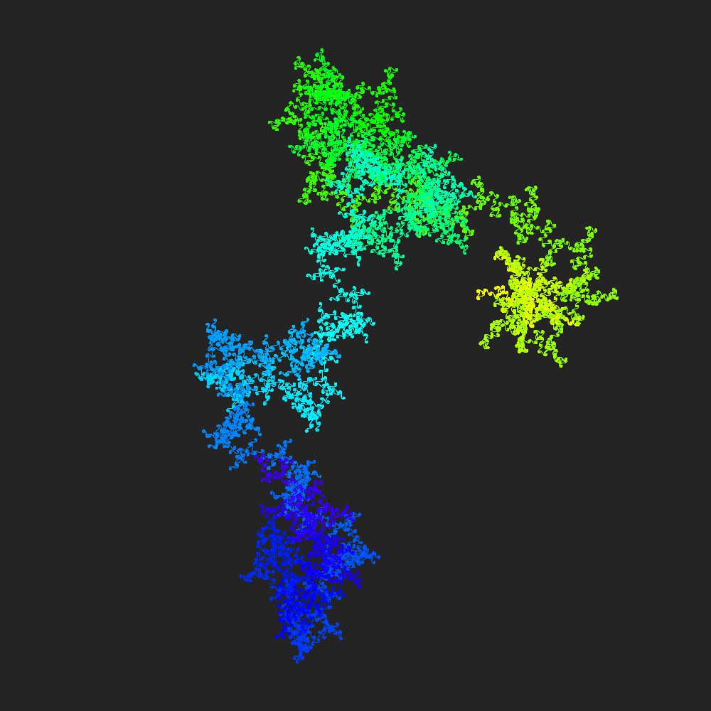
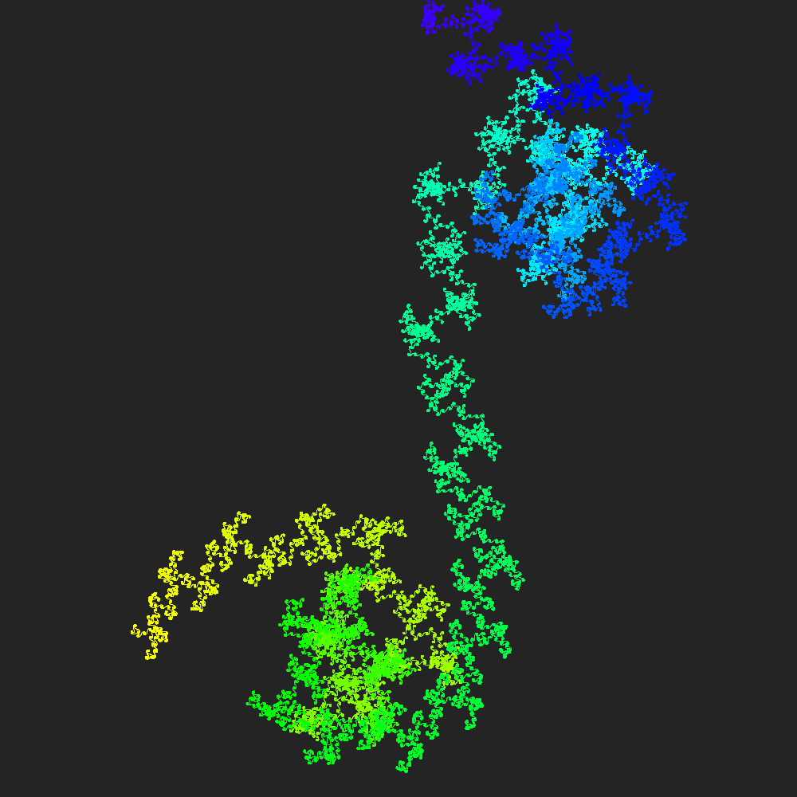
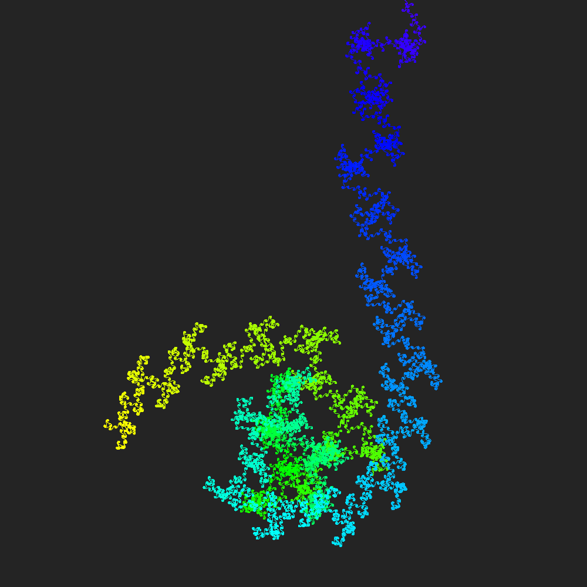
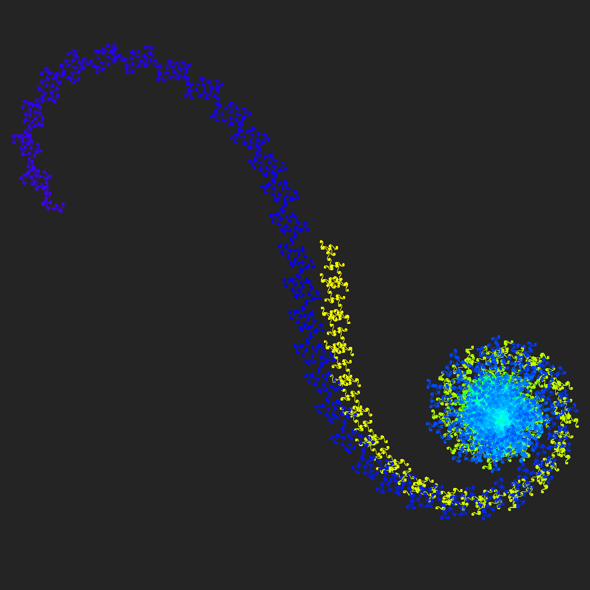

# EulerSpirals
A visual displaying of Euler spiral using java processing

!ATTENTION: this code was written using Processing Java, go to the link below and download the program for running the program smoothly. I've uploaded uploaded some pictures to show the program
 <a href="processing.org">processing.org</a>

 
You can use the following keyboard buttons in the program:
  <ul>
<li>UP arrow : increase angle value by 0.01</li>
<li>DOWN arrow : decrease angle value by 0.01</li>
<li>RIGHT arrow : increase iteration number according to the range it is</li>
<li>LEFT arrow : decrease iteration number according to the range it is</li>
<li>- or _ : Zoom out</li>
<li>= or + : zoom in</li>
<li>Space bar : Save 1000x1000 pixels image in PNG format</li>
    </ul>

<table>
  <tr>
    <td></td>
    <td></td>
  </tr>
  <tr>
    <td></td>
    <td></td>
  </tr>
</table>
