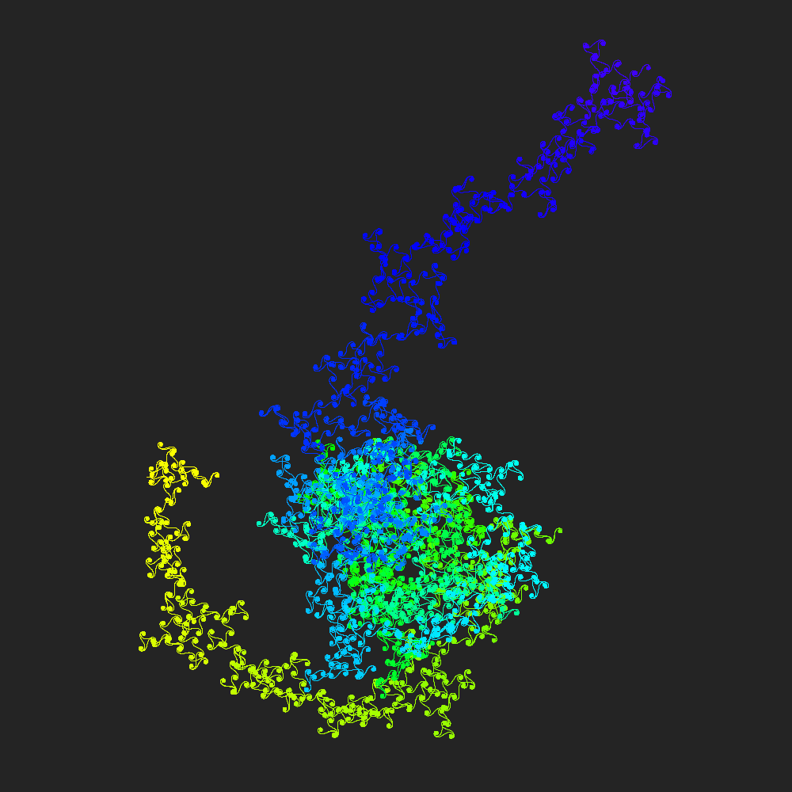

# EulerSpirals
A visual displaying of Euler spiral using processing.js

!ATTENTION: this code was written using Processing Java, go to the link below and download the program for running the program smoothly. I've uploaded uploaded some pictures to show the program

<a href="processing.org">processing.org</a>

